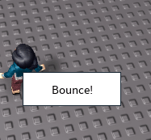

Roact-Animate is a powerful library to allow animating your [Roact](http://github.com/Roblox/roact) components. Under the hood, Roact-Animate uses [TweenService](http://wiki.roblox.com/index.php?title=API:Class/TweenService), allowing animations to be performed in a very performant fashion.

## Installation
Currently the recommended way to install Roact-Animate is by cloning the library and syncing it into Studio with [Rojo](https://github.com/LPGhatguy/rojo). For more information on how to achieve this, please refer to the [Rojo documentation](https://lpghatguy.github.io/rojo/).

## Walkthrough: Bouncing button
Let's take a look at using Roact-Animate to make a button that bounces when you click it:



The only module that we need to require is the root Roact-Animate module (plus Roact, of course!). After that, we want to create a new stateful component:

!!! warning
    You must use Roact-Animate in stateful components. Roact-Animate animations are stateful by nature; additionally, stateful components are the only components with access to lifecycle hooks, which you often need in order to run your animations!

```lua
local BouncingButton = Roact.PureComponent:extend("BouncingButton")
```

In the component's `init` method, we create a `Value` for the button's position. A `Value` is a container for a normal Lua value that can be animated. You can use a `Value` to animate multiple actual objects, or just one.

```lua
function BouncingButton:init()
	self._position = RoactAnimate.Value.new(
		-- Use the Position property if it's given...
		self.props.Position
		-- ...or default to this position.
		or UDim2.new(0, 0, 0, 0)
	)
end
```

When rendering, we have to use special *animated* components: primitive components wrapped by Roact-Animate to allow their properties to be animated. Roact-Animate provides built-in animated components for the common GuiObjects:

* Frame
* ScrollingFrame
* TextLabel
* TextButton
* TextBox
* ImageLabel
* ImageButton

If there's a Roblox instance you want to animate that Roact-Animate doesn't provide, you can use the [makeAnimatedComponent](api#makeAnimatedComponent) function.

Moving along, in our `render` function, we need to use the animated `TextButton` component provided by Roact-Animate. Animated components let you supply a `Value` as one of their properties - this allows you to animate that property. Here, we want to move the button, so we set its `Position` property to the `Value` we created in `init`.

```lua
function BouncingButton:render()
	return Roact.createElement(RoactAnimate.TextButton, {
		-- Use a Value to make the property animateable.
		Position = self._position,
		-- Everything else can't be animated!
		BackgroundColor3 = Color3.new(1, 1, 1),
		Font = Enum.Font.SourceSans,
		Size = UDim2.new(0, 120, 0, 40),
		Text = "Bounce!",
		TextColor3 = Color3.new(0, 0, 0),
		TextSize = 18,
	})
end
```

We've scaffolded everything we need to make the button bounce. Now, we need to start the animation when we click it! We'll do this in an event listener.

To make an animation, you have three options:

* Call `RoactAnimate` with the animation you want to run
* Call `RoactAnimate.Sequence` with a table of the animations you want to run one at a time
* Call `RoactAnimate.Parallel` with a table of the animations you want to run all at once

We're going to do two animations: one to raise the button up, and another to have it bounce down. We want to do these one at a time, so we need to use `RoactAnimate.Sequence`. `Sequence` takes a list of animations and plays them one at a time, starting from the first animation given.

To create animations for `Sequence` to work with, we need to use `RoactAnimate`, which takes three arguments:

* The `Value` to animate
* The [TweenInfo](http://wiki.roblox.com/index.php?title=TweenInfo) to use for this animation
* The actual value to animate to

The two animations are very simple:

```lua
RoactAnimate(self._position, TweenInfo.new(0.125), self.props.Position - UDim2.new(0, 0, 0, 10))
RoactAnimate(self._position, TweenInfo.new(
	0.5,
	Enum.EasingStyle.Bounce
), self.props.Position)
```

We can wrap both of them in a table for `Sequence`:

```lua
RoactAnimate.Sequence({
	RoactAnimate(self._position, TweenInfo.new(0.125), self.props.Position - UDim2.new(0, 0, 0, 10)),
	RoactAnimate(self._position, TweenInfo.new(
		0.5,
		Enum.EasingStyle.Bounce
	), self.props.Position),
})
```

To start an animation, we call its `Start` method. We don't usually need to capture the animation in a variable, so we can just call the return value of `Sequence` directly:
```lua
RoactAnimate.Sequence({
	RoactAnimate(self._position, TweenInfo.new(0.125), self.props.Position - UDim2.new(0, 0, 0, 10)),
	RoactAnimate(self._position, TweenInfo.new(
		0.5,
		Enum.EasingStyle.Bounce
	), self.props.Position),
}):Start()
```

Now, we tie all of that together in an event listener on the button:

```lua
function BouncingButton:render()
	return Roact.createElement(RoactAnimate.TextButton, {
		-- Use a Value to make the property animateable.
		Position = self._position,
		-- Everything else can't be animated!
		BackgroundColor3 = Color3.new(1, 1, 1),
		Font = Enum.Font.SourceSans,
		Size = UDim2.new(0, 120, 0, 40),
		Text = "Bounce!",
		TextColor3 = Color3.new(0, 0, 0),
		TextSize = 18,
		[Roact.Event.MouseButton1Click] = function()
			RoactAnimate.Sequence({
				RoactAnimate(self._position, TweenInfo.new(0.125), self.props.Position - UDim2.new(0, 0, 0, 10)),
				RoactAnimate(self._position, TweenInfo.new(
					0.5,
					Enum.EasingStyle.Bounce
				), self.props.Position),
			}):Start()
		end,
	})
end
```

You can find the full code in the [examples folder](https://github.com/AmaranthineCodices/roact-animate/tree/master/examples).